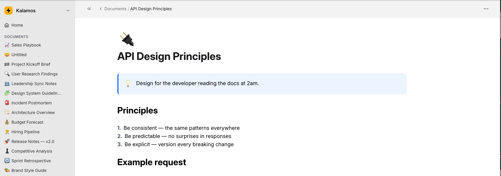

# Block Editor

[English](README.md) · [Русский](README.ru.md)

**Блочный редактор в стиле Notion для React, который хранит документы в виде обычного JSON — без Tiptap, Slate или Lexical.**



Добавьте `<BlockEditor>` в React-приложение и получите заголовки, списки, задачи,
код, формулы, медиа и slash-меню «из коробки». Документы — это просто
`{ blocks: Block[] }`: их легко хранить, сравнивать и отображать где угодно. В
комплекте идёт эталонный бэкенд (Koa + Sequelize + PostgreSQL) для хранения и
загрузки медиафайлов.

Редактор — это написанная с нуля блочная система на `contenteditable`, где
форматированный текст хранится в виде HTML в поле `text` каждого блока.

## Быстрый старт

```bash
npm install @kalamos/editor react react-dom
```

```tsx
import { useState } from 'react';
import { EditorProvider, BlockEditor, type Block } from '@kalamos/editor';
import '@kalamos/editor/styles.css';

export function MyEditor() {
  const [blocks, setBlocks] = useState<Block[]>([]);
  return (
    <EditorProvider>
      <BlockEditor blocks={blocks} onChange={setBlocks} />
    </EditorProvider>
  );
}
```

Это уже полностью рабочий редактор. Подключите `uploadAdapter` для медиа и бэкенд
для хранения, когда будете готовы — см. [ниже](#использование-пакета-редактора).

## Почему не Tiptap / Slate / Lexical?

| | Block Editor | Tiptap / Slate / Lexical |
| --- | --- | --- |
| Модель документа | Обычный JSON `{ blocks: Block[] }` | Деревья узлов конкретного фреймворка |
| Зависимости | Нет зависимостей от редактор-фреймворков | ProseMirror / собственное ядро |
| Блочный UX | Встроен (slash-меню, drag, переупорядочивание) | Реализуете сами или через расширения |
| Хранение | HTML на каждый блок, храните где угодно | Сериализация через фреймворк |
| Бэкенд | Эталонный Koa + Postgres в комплекте | Свой собственный |
| Кастомизация | API плагинов `registerBlock()` | Расширения схемы и node-view |

Выбирайте Block Editor, когда нужен блочный UX в стиле Notion с простым,
переносимым JSON-документом и без большого редактор-фреймворка для изучения.
Выбирайте остальные, когда нужны их зрелые экосистемы или тонкий контроль на
уровне ProseMirror.

## Структура репозитория

```
kalamos/
├── packages/
│   └── editor/        @kalamos/editor — пакет редактора на React
├── apps/
│   ├── server/        эталонный бэкенд на Koa + Sequelize + PostgreSQL
│   └── demo/          демо на Vite + React 19, связывающее редактор с бэкендом
├── docker-compose.yml postgres + server + demo
└── .github/workflows/ CI + публикация
```

## Быстрый старт (Docker)

```bash
docker compose up --build
# демо:    http://localhost:5173
# сервер:  http://localhost:4000
```

Загрузить пример документа:

```bash
docker compose exec server yarn db:seed
```

## Локальная разработка

Требуется Node 22+ и Yarn 4 (через Corepack).

```bash
corepack enable
yarn install

# Терминал 1 — бэкенд (по умолчанию использует sqlite для разработки без настройки):
DB_DIALECT=sqlite yarn dev:server

# Терминал 2 — демо:
yarn dev:demo
```

Собрать всё / проверить типы / запустить тесты:

```bash
yarn build
yarn typecheck
yarn test
```

## Использование пакета редактора

```bash
npm install @kalamos/editor react react-dom
```

```tsx
import { useState } from 'react';
import { EditorProvider, BlockEditor, type Block } from '@kalamos/editor';
import '@kalamos/editor/styles.css';

function MyEditor() {
  const [blocks, setBlocks] = useState<Block[]>([]);
  return (
    <EditorProvider uploadAdapter={myUploadAdapter}>
      <BlockEditor blocks={blocks} onChange={setBlocks} />
    </EditorProvider>
  );
}
```

> **Стилизация:** редактор использует утилитарные классы Tailwind. Либо соберите
> Tailwind в своём приложении и подключите исходники редактора через `@source`
> (см. `apps/demo/src/index.css`), либо предоставьте собственные эквивалентные
> классы. `@kalamos/editor/styles.css` поставляет части, не относящиеся к
> Tailwind (KaTeX, highlight.js, плейсхолдеры contenteditable).

### UploadAdapter

Загрузка медиафайлов вынесена наружу, чтобы редактор оставался независимым от
хранилища:

```ts
import type { UploadAdapter } from '@kalamos/editor';

const myUploadAdapter: UploadAdapter = {
  uploadImage: (file) => post('/api/v1/media/image', file),
  uploadVideo: (file) => post('/api/v1/media/video', file),
  uploadAudio: (file) => post('/api/v1/media/audio', file),
  uploadFile:  (file) => post('/api/v1/media/file', file),
  // опционально: uploadImageFromUrl, deleteByUrl, proxyImageUrl, searchUnsplash, ...
};
```

Каждый метод возвращает `{ url }`. См. `apps/demo/src/uploadAdapter.ts`.

### Пользовательские блоки (API плагинов реестра)

Регистрируйте собственные типы блоков и (при желании) пункты slash-меню:

```tsx
import { registerBlock, type BlockRendererProps } from '@kalamos/editor';

registerBlock({
  type: 'callout-tip',
  slashMenu: { group: 'Custom', label: 'Tip callout', keywords: ['tip'] },
  initialData: () => ({ text: 'A helpful tip.' }),
  render: ({ block, contentProps }: BlockRendererProps) => (
    <div className="rounded bg-emerald-50 p-3">
      <div {...contentProps} dangerouslySetInnerHTML={{ __html: block.text }} />
    </div>
  ),
});
```

См. `apps/demo/src/customBlocks.tsx`.

### Локализация

Редактор поставляется с английскими значениями по умолчанию. Переопределите любую
строку через `EditorProvider`:

```tsx
import { EditorProvider, defaultStrings } from '@kalamos/editor';

<EditorProvider strings={{ editor: { bold: 'Gras' } }}>{children}</EditorProvider>
```

## Формат документа

```jsonc
{
  "blocks": [
    { "id": "b1", "type": "h1", "text": "Title" },
    { "id": "b2", "type": "paragraph", "text": "Body with <b>bold</b>." },
    { "id": "b3", "type": "todo", "text": "Task", "checked": false }
  ]
}
```

Хранится в Postgres как `documents.content` (`JSONB`). Тип `Block` экспортируется
из пакета.

## Эталонный бэкенд

Koa + Sequelize-TypeScript + PostgreSQL (sqlite поддерживается для разработки/тестов).

- `GET/POST /api/v1/documents`, `GET/PUT/DELETE /api/v1/documents/:id`
- `POST /api/v1/media/{image,video,audio,file}` (multipart `file`)
- Подключаемый `StorageDriver`: локальный диск `local` (по умолчанию) или
  S3-совместимое хранилище (`@aws-sdk/client-s3`).
- Опциональная защита через bearer-токен с помощью `API_TOKEN` (по умолчанию выключена).

См. `apps/server/.env.example` для настройки.

## Лицензия

MIT
